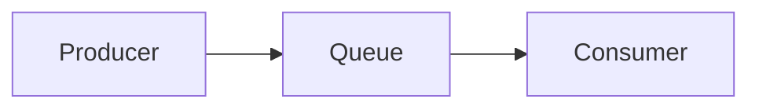

## 问题

一次延迟尖峰往往由多个很小的等待叠加而成。先确认现象发生在哪一层，再决定需要增加哪些观测点[^queue]。

**现象边界：**

不要从平均值开始。尾延迟、队列深度和超时分布更容易暴露慢消费者。

## 测量

下面的最小采样同时保留队列深度和等待阈值。

```ts file="latency.ts" showLineNumbers
const queueDepth = sampleQueueDepth(); // [!code highlight]
const timeoutMs = 30; // [!code --]
const timeoutMs = 50; // [!code ++]
```

### 关键指标

| 指标     | 用途                   |
| -------- | ---------------------- |
| 队列深度 | 判断生产与消费是否失衡 |
| 尾延迟   | 观察少量慢请求的影响   |




## 结论

先测量队列等待，再逐段排除阻塞调用和调度抖动。

[^queue]: 队列数据应在同一采样窗口内比较，避免时间范围不一致。

## 参考资料

- Node.js, _The Node.js Event Loop_, https://nodejs.org/，访问于 2026-09-09。
